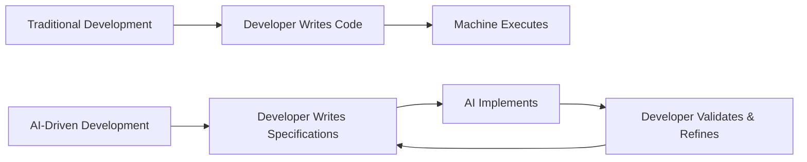

# Chapter 2: Introducing AI-Driven Development

import InteractiveDiagram, { Diagrams } from '@site/src/components/InteractiveDiagram';

<div style={{textAlign: 'center', margin: '3rem 0'}}>
  
</div>

## What is AI-Driven Development?

AI-Driven Development (AIDD) represents a fundamental shift in how software gets built. Instead of writing every line of code manually, developers **collaborate with AI assistants** to design, implement, test, and deploy software systems.

### The Core Distinction



:::info Key Insight
AI-Driven Development isn't about replacing developers—it's about **amplifying their capabilities** by shifting focus from implementation to architecture and requirements.
:::

## The Evolution: From Code to Specifications

### Historical Context

**1950s-1960s: Assembly Language**
```asm
MOV AX, 5
ADD AX, 3
MOV result, AX
```
*Developers controlled every CPU instruction.*

**1970s-1990s: High-Level Languages**
```c
int result = 5 + 3;
```
*Abstraction allowed focus on logic, not hardware.*

**2000s-2010s: Frameworks & Libraries**
```python
result = calculate_sum([5, 3])
```
*Reusable components accelerated development.*

**2020s+: AI-Driven Specifications**
```markdown
**Feature: Sum Calculator**
Create a function that:
- Accepts a list of numbers
- Returns their sum
- Handles edge cases (empty list, non-numbers)
- Includes unit tests
```
*Natural language specifications generate implementation.*

### Each Era's Productivity Gain

- Assembly → C: **~5-10x** productivity
- C → Python/Java: **~3-5x** productivity
- Manual → Frameworks: **~2-3x** productivity
- Traditional → AI-Driven: **~5-10x** productivity
- AI-Driven → AI-Native: **~10-50x** productivity

## The Three Development Paradigms

### Level 1: AI-Assisted Development

**Characteristics:**
- AI provides suggestions while you code
- Autocomplete on steroids
- Reactive, not proactive
- You're still writing most code manually

**Tools:**
- GitHub Copilot
- Tabnine
- Amazon CodeWhisperer
- JetBrains AI Assistant

**Example Workflow:**
```typescript
// You type:
function validateEmail

// Copilot suggests:
function validateEmail(email: string): boolean {
  const emailRegex = /^[^\s@]+@[^\s@]+\.[^\s@]+$/;
  return emailRegex.test(email);
}
```

**Productivity Gain: 2-3x**

### Level 2: AI-Driven Development

**Characteristics:**
- AI generates entire features from specifications
- Conversational refinement
- You architect, AI implements
- Focus on requirements and design

**Tools:**
- Claude Code
- Cursor AI
- ChatGPT with Code Interpreter
- v0.dev (for UI)

**Example Workflow:**
```markdown
**Specification:**
Create a REST API endpoint for user registration that:
- Accepts email and password
- Validates email format
- Hashes password with bcrypt
- Stores user in PostgreSQL
- Returns JWT token
- Handles duplicate email errors
- Includes integration tests
```

**AI generates:**
- Database schema
- API endpoint implementation
- Validation logic
- Error handling
- Tests
- Documentation

**Productivity Gain: 5-10x**

### Level 3: AI-Native Development

**Characteristics:**
- AI is the core system component
- Agents make autonomous decisions
- Tool use and function calling
- Self-improving systems
- Multi-agent collaboration

**Tools:**
- LangGraph
- AutoGen
- CrewAI
- Custom agent frameworks

**Example Workflow:**
```python
# You define the system:
class SoftwareEngineeringTeam:
    architect = Agent("System Designer")
    backend_dev = Agent("Backend Implementation")
    frontend_dev = Agent("Frontend Implementation")
    tester = Agent("QA & Testing")
    reviewer = Agent("Code Review")

# Agents collaborate autonomously:
project = "Build a task management app"
team.execute(project)  # Agents discuss, design, implement, test
```

**Productivity Gain: 50-99x** (domain-specific)

## Real-World Impact: Case Studies

### Case Study 1: SaaS Startup MVP

**Traditional Timeline:**
- Team: 3 developers, 1 designer
- Timeline: 4-6 months
- Cost: $200K-$300K

**AI-Driven Timeline:**
- Team: 1 developer + AI
- Timeline: 2-4 weeks
- Cost: $10K-$20K

**Reduction: 90% time, 95% cost**

### Case Study 2: Enterprise Feature Development

**Traditional Approach:**
- Feature: Customer analytics dashboard
- Team: 5 developers
- Timeline: 8 weeks
- Lines of code: ~15,000

**AI-Driven Approach:**
- Team: 2 developers + AI
- Timeline: 1.5 weeks
- Generated code: ~12,000 lines
- Manual code: ~3,000 lines

**Productivity multiplier: 5.3x**

### Case Study 3: Solo Developer Product

**Developer Background:**
- Experience: 2 years programming
- Idea: Niche SaaS tool for real estate agents
- Resources: Nights and weekends

**Without AI:**
- Estimated timeline: 18-24 months
- Likelihood of completion: Less than 20%

**With AI-Driven Development:**
- Actual timeline: 3 months
- MVP launched and generating revenue
- Now has 150 paying customers

## The Skill Shift: What Changes

### Skills That Become Less Important

| Traditional Skill | Why It's Less Critical |
|-------------------|------------------------|
| Typing speed | AI writes the code |
| Syntax memorization | AI knows all languages |
| Stack Overflow searching | AI has built-in knowledge |
| Boilerplate writing | AI generates it instantly |
| Manual debugging | AI identifies and fixes bugs |

### Skills That Become More Important

| New Priority Skill | Why It Matters |
|--------------------|----------------|
| **System design** | You architect, AI implements |
| **Requirement articulation** | Clear specs = better AI output |
| **Domain knowledge** | Differentiates you from generic AI |
| **Critical validation** | You must verify AI decisions |
| **Prompt engineering** | Communication with AI is key |

:::warning Don't Confuse This With
AI-Driven Development is **NOT**:
- ❌ Copy-pasting from ChatGPT without understanding
- ❌ Accepting AI suggestions blindly
- ❌ Abandoning software engineering principles
- ❌ Writing low-quality code faster

It **IS**:
- ✅ Accelerated implementation of well-designed systems
- ✅ Rapid prototyping and iteration
- ✅ Focus on architecture and business logic
- ✅ Maintaining high-quality standards with AI assistance
:::

## Your Development Workflow Transformation

### Before (Traditional Development)

```
1. Read requirements (30 min)
2. Design solution (1 hour)
3. Write implementation code (6-8 hours)
4. Debug and fix issues (2-3 hours)
5. Write tests (2 hours)
6. Write documentation (1 hour)
7. Code review and refactor (2 hours)

Total: ~16-18 hours per feature
```

### After (AI-Driven Development)

```
1. Write specification (45 min)
2. AI generates implementation (5 min)
3. Review and refine with AI (1 hour)
4. AI generates tests (5 min)
5. Validate edge cases (30 min)
6. AI generates documentation (5 min)
7. Final review and deployment (30 min)

Total: ~3-4 hours per feature
```

**Result: 4-5x productivity gain**

## Common Misconceptions Debunked

### Misconception 1: "AI Will Replace Developers"

**Reality:** AI **augments** developers. The need for software is growing faster than AI can build it. Demand for skilled developers is **increasing**, not decreasing.

**Evidence:**
- 96% of enterprises investing in AI initiatives
- Developer job openings at all-time highs
- Salaries for AI-skilled developers rising

### Misconception 2: "Quality Will Suffer"

**Reality:** AI-driven code often has **fewer bugs** because:
- AI follows consistent patterns
- Comprehensive test coverage by default
- Multiple iterations are fast and cheap
- Best practices baked in

**Evidence:**
- Microsoft study: GitHub Copilot reduces bugs by 15-30%
- AI-generated code passes code review at similar rates to human code
- Automated testing coverage improves dramatically

### Misconception 3: "You Don't Need to Understand Code"

**Reality:** Understanding is **more important** than ever. You must:
- Validate AI-generated logic
- Make architectural decisions
- Debug when things go wrong
- Optimize for performance
- Ensure security and reliability

**Analogy:** Using a calculator doesn't mean you don't need to understand math.

### Misconception 4: "It's Just Hype"

**Reality:** This is **measurably transformative**:
- Productivity gains: **documented and reproducible**
- Enterprise adoption: **widespread and accelerating**
- Market disruption: **already happening**
- Developer experience: **fundamentally different**

## Getting Started: Your First AI-Driven Project

### Prerequisites

1. **Basic programming knowledge** (any language)
2. **Access to an AI coding assistant** (Claude, ChatGPT, Copilot)
3. **Willingness to experiment** and iterate
4. **Open mind** about new workflows

### Starter Project: Todo API

Let's build a complete REST API using AI-Driven Development:

**Step 1: Write Specification**

```markdown
# Todo API Specification

## Requirements
Create a RESTful API for managing todo items with:

### Data Model
- id (UUID, auto-generated)
- title (string, required, max 200 chars)
- description (string, optional)
- completed (boolean, default false)
- created_at (timestamp, auto-generated)
- updated_at (timestamp, auto-updated)

### Endpoints
1. GET /todos - List all todos (with pagination)
2. GET /todos/:id - Get single todo
3. POST /todos - Create new todo
4. PUT /todos/:id - Update todo
5. DELETE /todos/:id - Delete todo
6. PATCH /todos/:id/complete - Mark as complete

### Technical Requirements
- Use Express.js with TypeScript
- PostgreSQL database with TypeORM
- Input validation using Zod
- Error handling middleware
- Request logging
- CORS enabled
- OpenAPI documentation
- Unit and integration tests (Jest)
- Docker Compose for local development

### Non-Functional Requirements
- Response time < 200ms for all endpoints
- Handle 1000 concurrent requests
- Graceful error messages
- Health check endpoint
```

**Step 2: Generate with AI**

Use Claude Code, Cursor, or ChatGPT:
```
Please implement the Todo API according to this specification:
[paste specification]

Start with the project structure and configuration files.
```

**Step 3: Iterate and Refine**

```
Add these improvements:
1. Add filtering by completion status
2. Add search by title
3. Add bulk operations endpoint
4. Optimize database queries with indexes
```

**Step 4: Generate Tests**

```
Generate comprehensive tests covering:
- All endpoints (happy paths)
- Error cases (validation, not found, server errors)
- Edge cases (empty lists, duplicate operations)
- Performance tests (load testing)
```

**Step 5: Generate Documentation**

```
Create:
1. README with setup instructions
2. API documentation with examples
3. Architecture decision records (ADRs)
4. Deployment guide for Docker
```

**Result:** Complete, production-ready API in **2-3 hours** instead of 2-3 days.

## Measuring Your AI-Driven Productivity

### Key Metrics

**1. Time-to-Implementation**
- Before: How long did features take manually?
- After: How long with AI assistance?
- Target: 3-5x reduction

**2. Code Quality**
- Bug rate in first week after deployment
- Code review comments
- Test coverage percentage
- Target: Equal or better than manual

**3. Iteration Speed**
- How quickly can you prototype alternatives?
- How fast can you respond to feedback?
- Target: 10x faster iterations

**4. Learning Velocity**
- New technologies adopted per quarter
- New patterns implemented
- Target: 2-3x more experimentation

### Tracking Template

```markdown
## Feature: [Name]
**Complexity:** [Simple/Medium/Complex]
**Traditional Estimate:** [hours]
**AI-Driven Actual:** [hours]
**Multiplier:** [X]x
**Quality:** [Bugs found in first week]
**Notes:** [What worked, what didn't]
```

## Next Steps in Your Journey

You've now understood the **what** and **why** of AI-Driven Development. Next, we'll explore:

1. **Part 2:** The AI tool landscape—which tools for which tasks
2. **Part 3:** Mastering markdown and prompt engineering
3. **Part 4:** Specification-Driven Development fundamentals
4. **Part 5-14:** Deep dives into implementation, agents, and advanced topics

:::tip Action Item
**Before moving to Part 2**, try building a simple project using AI assistance:
- A URL shortener
- A weather dashboard
- A personal journal app

Document your experience: What went well? What was challenging? This will make the later chapters more concrete.
:::

---

## Key Takeaways

1. **AI-Driven Development is a paradigm shift**, not just a new tool
2. **Productivity gains of 5-10x are realistic and measurable**
3. **Your role transforms from coder to architect and validator**
4. **Quality improves when AI assistance is used correctly**
5. **Getting started is easier than you think**

The future of software development is collaborative, fast, and increasingly accessible. You're not just learning new tools—you're learning a new way to think about building software.

**Ready to explore the tools that make this possible? Let's continue to Part 2: AI Tool Landscape.**


---


## 🚀 AI-Driven Development Workflow

<InteractiveDiagram
  title="Complete AI-Driven Development Cycle"
  diagram={Diagrams.aiDevelopmentWorkflow}
  caption="The iterative cycle of AI-driven development from requirements to deployment."
/>

\n## 🎴 Test Your Knowledge

import Flashcards, { ChapterFlashcards } from '@site/src/components/Flashcards';

<Flashcards cards={ChapterFlashcards.ch5} title="Chapter Flashcards" />

---

## 📝 Chapter Quiz

import MCQ, { ChapterMCQ } from '@site/src/components/MCQ';

<MCQ questions={ChapterMCQ.ch2} title="Chapter 2 Quiz" />

---
