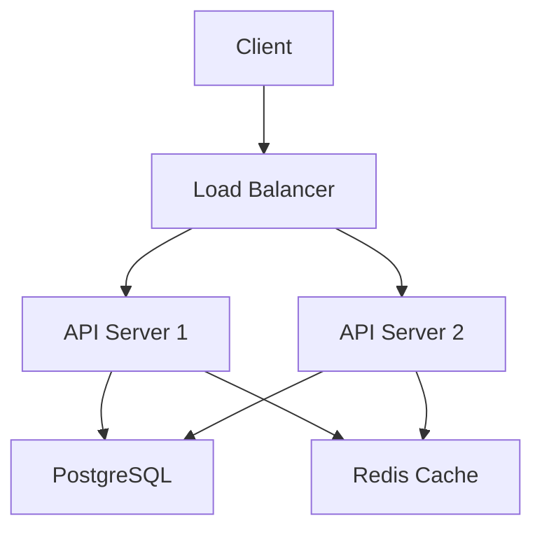

# Chapter 4: Markdown, Prompt & Context Engineering

import InteractiveDiagram from '@site/src/components/InteractiveDiagram';

<div style={{textAlign: 'center', margin: '3rem 0'}}>
  
</div>

## Why Markdown is the Universal Specification Language

Markdown has become the **de facto language** for AI-native specifications because:

1. **Human-readable:** Anyone can understand it
2. **Machine-parseable:** AI models excel at markdown
3. **Version-control friendly:** Works perfectly with Git
4. **Tool-agnostic:** Supported everywhere
5. **Hierarchical:** Natural structure for complex specs

:::info The Specification Language Evolution
- 1990s: Word documents and PDFs
- 2000s: Wiki pages and Confluence
- 2010s: Markdown in repositories
- 2020s+: **Markdown as executable specifications**
:::

## Markdown Fundamentals for AI Specifications

### Structure Your Specifications

**Basic Hierarchy:**
```markdown
# Project Title (H1)
## Major Section (H2)
### Subsection (H3)
#### Component (H4)
##### Detail (H5)
```

**Best Practice:**
```markdown
# User Authentication System

## Overview
Brief description of the system

## Requirements
### Functional Requirements
- User registration
- Login/logout
- Password reset

### Non-Functional Requirements
- Response time < 200ms
- 99.9% uptime
- SOC 2 compliance

## Technical Specification
### Data Models
#### User Model
...
```

### Using Lists Effectively

**Unordered Lists (Features):**
```markdown
## Features
- User registration with email verification
- Social login (Google, GitHub)
- Two-factor authentication
- Session management
- Password strength validation
```

**Ordered Lists (Sequences):**
```markdown
## User Registration Flow
1. User submits email and password
2. System validates input
3. System checks for existing user
4. System hashes password (bcrypt, 10 rounds)
5. System creates database record
6. System sends verification email
7. User clicks verification link
8. System activates account
```

**Nested Lists (Hierarchies):**
```markdown
## System Architecture
- **Frontend**
  - React 18
  - TypeScript
  - Tailwind CSS
  - React Query for state
- **Backend**
  - Node.js
  - Express
  - PostgreSQL
  - Redis for sessions
- **Infrastructure**
  - Docker containers
  - Kubernetes orchestration
  - AWS deployment
```

### Tables for Structured Data

**API Endpoints:**
```markdown
| Method | Endpoint | Description | Auth Required |
|--------|----------|-------------|---------------|
| POST | /api/auth/register | Create new user | No |
| POST | /api/auth/login | Authenticate user | No |
| POST | /api/auth/logout | End session | Yes |
| GET | /api/auth/me | Get current user | Yes |
| PUT | /api/auth/password | Change password | Yes |
```

**Data Models:**
```markdown
| Field | Type | Required | Validation |
|-------|------|----------|------------|
| id | UUID | Yes | Auto-generated |
| email | string | Yes | Valid email format |
| password_hash | string | Yes | Min 60 chars (bcrypt) |
| is_verified | boolean | Yes | Default: false |
| created_at | timestamp | Yes | Auto-generated |
```

### Code Blocks with Context

**Specify Language:**
```markdown
## Database Schema

```sql
CREATE TABLE users (
  id UUID PRIMARY KEY DEFAULT gen_random_uuid(),
  email VARCHAR(255) UNIQUE NOT NULL,
  password_hash VARCHAR(255) NOT NULL,
  is_verified BOOLEAN DEFAULT false,
  created_at TIMESTAMP DEFAULT CURRENT_TIMESTAMP
);

CREATE INDEX idx_users_email ON users(email);
```

\`\`\`

**Include Expected Behavior:**
```markdown
## Email Validation Function

Expected behavior:
- Accepts string input
- Returns boolean
- Validates format (RFC 5322)
- Rejects common typos
- Case-insensitive

```typescript
function isValidEmail(email: string): boolean {
  // AI will implement based on requirements
}
```
\`\`\`
```

### Embedding Diagrams

**Mermaid Diagrams:**
```markdown
## System Architecture


\`\`\`
```

**Renders as:**


## Prompt Engineering Fundamentals

<InteractiveDiagram
  title="Prompt Engineering Workflow"
  diagram={`graph TD
    Context[📋 Define Context] --> Objective[🎯 Set Clear Objective]
    Objective --> Scope[🔍 Define Scope]
    Scope --> Constraints[⚠️ Add Constraints]
    Constraints --> Examples[📝 Provide Examples]
    Examples --> Criteria[✅ Success Criteria]
    Criteria --> Prompt[💬 Complete Prompt]

    Prompt --> AI[🤖 AI Processing]
    AI --> Output[📤 Generated Output]
    Output --> Review{👀 Review}

    Review -->|Good| Accept[✅ Accept]
    Review -->|Needs Work| Refine[🔧 Refine Prompt]
    Refine --> Context

    style Context fill:#ff4757,stroke:#2f3542,stroke-width:3px
    style Scope fill:#ffa502,stroke:#2f3542,stroke-width:3px
    style Constraints fill:#ffd700,stroke:#2f3542,stroke-width:3px
    style Examples fill:#00d2d3,stroke:#2f3542,stroke-width:3px
    style Criteria fill:#5352ed,stroke:#2f3542,stroke-width:3px
    style Prompt fill:#ff6348,stroke:#2f3542,stroke-width:3px
    style AI fill:#a29bfe,stroke:#2f3542,stroke-width:3px
    style Output fill:#1e90ff,stroke:#2f3542,stroke-width:3px
    style Review fill:#fd79a8,stroke:#2f3542,stroke-width:3px
    style Accept fill:#2ed573,stroke:#2f3542,stroke-width:3px
    style Refine fill:#fdcb6e,stroke:#2f3542,stroke-width:3px`}
  caption="The iterative workflow of crafting effective prompts with the six essential elements."
/>

### The Anatomy of an Effective Prompt

**Poor Prompt:**
```
Make a login page
```

**Good Prompt:**
```markdown
# User Login Page

## Requirements
Create a responsive login page with:

### UI Components
- Email input (type="email")
- Password input (type="password", toggle visibility)
- "Remember me" checkbox
- "Forgot password?" link
- "Sign in" button (primary action)
- "Create account" link

### Validation
- Client-side validation before submission
- Show error messages below each field
- Disable button during submission

### Behavior
- Submit on Enter key
- Show loading state during API call
- Redirect to dashboard on success
- Display API error messages
- Focus email field on page load

### Styling
- Use Tailwind CSS
- Center card on page
- Max width 400px
- Consistent spacing (space-y-4)
- Primary color: blue-600

### Accessibility
- Proper ARIA labels
- Keyboard navigable
- Screen reader friendly
- Focus indicators visible
```

**Excellent Prompt (with examples):**
```markdown
# User Login Page

[... all requirements from above ...]

## Example Implementation Style

Similar to:
- Vercel login page (clean, minimal)
- Linear app authentication (smooth animations)

## Error Handling Examples

Email errors:
- Empty: "Email is required"
- Invalid: "Please enter a valid email address"

Password errors:
- Empty: "Password is required"
- Too short: "Password must be at least 8 characters"

API errors:
- Invalid credentials: "Email or password is incorrect"
- Account locked: "Account temporarily locked. Try again in 15 minutes."
- Server error: "Something went wrong. Please try again."

## Success Behavior
1. Show success message (green checkmark + "Login successful")
2. Wait 500ms for visual feedback
3. Redirect to /dashboard
```

### The Six Elements of Great Prompts

#### 1. **Context** (Who, What, Why)
```markdown
# Context
You are building an authentication system for a SaaS application.
The target users are business professionals who value security and simplicity.
This login page is their first interaction with the application.
```

#### 2. **Objective** (Clear Goal)
```markdown
# Objective
Create a secure, accessible, and user-friendly login page that:
- Reduces login friction
- Provides clear error messages
- Follows security best practices
```

#### 3. **Scope** (Boundaries)
```markdown
# Scope
In scope:
- Email/password authentication
- Client-side validation
- Error handling
- Responsive design

Out of scope:
- Social authentication (separate feature)
- Multi-factor authentication (v2)
- Password reset flow (separate page)
- Registration (separate page)
```

#### 4. **Constraints** (Limitations)
```markdown
# Constraints
- Must work on IE11+ (legacy requirement)
- API response time may be slow (2-5s typical)
- Cannot use external auth libraries (security policy)
- Must match existing design system colors
```

#### 5. **Examples** (Show, Don't Just Tell)
```markdown
# Examples

## Good Examples
- Stripe dashboard login: https://dashboard.stripe.com/login
- Notion login: https://www.notion.so/login

## What We Like
- Clean, uncluttered layout
- Inline validation feedback
- Smooth transitions
- Professional appearance

## What to Avoid
- Captcha on every login
- Confusing error messages
- Too many form fields
- Distracting animations
```

#### 6. **Success Criteria** (How to Know It's Right)
```markdown
# Success Criteria
- [ ] All form fields validate correctly
- [ ] Error messages are clear and actionable
- [ ] Page is fully accessible (WCAG AA)
- [ ] Mobile responsive (< 768px)
- [ ] Loads in < 1 second
- [ ] Works in all major browsers
- [ ] Passes security audit
```

## Advanced Prompting Techniques

### Chain-of-Thought Prompting

**Standard Prompt:**
```
Optimize this database query for performance
```

**Chain-of-Thought:**
```markdown
## Query Optimization Task

Current query:
```sql
SELECT * FROM orders
WHERE user_id = 123
ORDER BY created_at DESC;
```

Please analyze and optimize by:
1. Identifying the current bottlenecks
2. Checking if appropriate indexes exist
3. Evaluating if SELECT * is necessary
4. Considering query plan and execution time
5. Proposing optimized version
6. Explaining the improvements and expected impact

Expected outcome: 50-80% performance improvement
```

**Result:** AI provides more thorough, well-reasoned optimization.

### Few-Shot Learning

**Give AI examples of what you want:**

```markdown
## Task: Write Component Documentation

### Example 1 (Good)
**Component:** Button
**Purpose:** Primary action trigger
**Props:**
- `variant`: "primary" | "secondary" | "ghost"
- `size`: "sm" | "md" | "lg"
- `onClick`: () => void
- `disabled`: boolean
**Example:**
```tsx
<Button variant="primary" size="md" onClick={handleSubmit}>
  Submit
</Button>
```

### Example 2 (Good)
**Component:** Input
**Purpose:** Text input field
**Props:**
- `type`: "text" | "email" | "password"
- `value`: string
- `onChange`: (value: string) => void
- `placeholder`: string
- `error`: string | undefined
**Example:**
```tsx
<Input
  type="email"
  value={email}
  onChange={setEmail}
  placeholder="you@example.com"
  error={errors.email}
/>
```

Now document the Modal component following the same style.
```

### Iterative Refinement Pattern

**Round 1:**
```markdown
Create a REST API for todo management
```

**Round 2 (after seeing output):**
```markdown
Good start! Now add:
- Input validation using Zod
- Error handling middleware
- Request rate limiting
- OpenAPI documentation
```

**Round 3:**
```markdown
Excellent! Final refinements:
- Add pagination to list endpoint
- Add filtering by completion status
- Add bulk operations endpoint
- Optimize database queries
```

**Key:** Each iteration adds 20-30% more detail, not 100%.

### Role-Based Prompting

**Assign AI a specific expertise:**

```markdown
# Role: Senior Backend Engineer with 10 years Node.js experience

As an expert in Node.js performance optimization, review this code:

```typescript
app.get('/api/users', async (req, res) => {
  const users = await db.query('SELECT * FROM users');
  res.json(users);
});
```

Identify:
1. Performance issues
2. Security vulnerabilities
3. Best practice violations
4. Scalability concerns

Provide specific, actionable improvements.
```

## Context Engineering

### Understanding Context Windows

**Context Window:** The amount of text AI can "see" at once

| Model | Context Window | Equivalent |
|-------|----------------|------------|
| GPT-3.5 | 16K tokens | ~30 pages |
| GPT-4 | 128K tokens | ~240 pages |
| GPT-4 Turbo | 128K tokens | ~240 pages |
| Claude 3.5 Sonnet | 200K tokens | ~375 pages |
| Gemini 1.5 Pro | 1M tokens | ~1,875 pages |

:::tip Context Strategy
**Don't waste context on boilerplate.** Every token counts. Be concise but comprehensive.
:::

### Providing Relevant Context

**Inefficient Context:**
```
// Including entire codebase in prompt
[50,000 lines of code]

Make the login button blue.
```

**Efficient Context:**
```markdown
## Current Implementation
```tsx
// components/LoginButton.tsx (lines 15-23)
<button className="bg-gray-500 hover:bg-gray-600">
  Login
</button>
```

## Request
Change button color to blue (matching design system: bg-blue-600, hover:bg-blue-700)
```

### The Inverted Pyramid of Context

**Most Important → Least Important**

```markdown
# 1. OBJECTIVE (Top priority)
Change user profile API to return avatar URLs

# 2. CURRENT STATE (What exists)
```typescript
interface User {
  id: string;
  name: string;
  email: string;
}
```

# 3. DESIRED STATE (What you want)
```typescript
interface User {
  id: string;
  name: string;
  email: string;
  avatar_url: string | null;
}
```

# 4. CONSTRAINTS (Limitations)
- Must maintain backward compatibility
- Avatar URLs are stored in S3
- Null if user hasn't uploaded avatar

# 5. ADDITIONAL DETAILS (Nice-to-have context)
- Currently 10K active users
- S3 bucket: user-avatars-prod
- Image format: JPEG, PNG (max 2MB)
```

If AI hits context limits, it still has the critical info.

## Specification Best Practices

### DO: Be Explicit About Edge Cases

```markdown
## User Registration

### Edge Cases to Handle
1. **Email already exists**
   - Response: 409 Conflict
   - Message: "An account with this email already exists"
   - Action: Prompt user to login or reset password

2. **Email service down**
   - Create user account anyway
   - Flag as "pending verification"
   - Retry email send via background job

3. **Invalid email format**
   - Response: 400 Bad Request
   - Message: "Please enter a valid email address"
   - Examples of invalid: "user@", "@domain.com", "user domain.com"

4. **Weak password**
   - Reject if < 8 characters
   - Reject if no numbers or special chars
   - Show strength meter in real-time
```

### DON'T: Be Vague

❌ **Bad:**
```markdown
Make it work properly and handle errors
```

✅ **Good:**
```markdown
## Error Handling Requirements

### Validation Errors (400)
- Return field-specific error messages
- Format: `{ field: string, message: string }[]`
- Example: `[{ field: "email", message: "Invalid email format" }]`

### Authentication Errors (401)
- Clear session/token
- Redirect to login
- Preserve intended destination URL

### Server Errors (500)
- Log full stack trace
- Return generic message to user
- Trigger alert to on-call engineer
- Show user-friendly error page
```

### DO: Include Performance Requirements

```markdown
## Performance Targets

### API Response Times (95th percentile)
- List endpoints: < 200ms
- Detail endpoints: < 100ms
- Write operations: < 300ms

### Database Query Optimization
- All queries must use indexes
- No SELECT * in production
- Pagination required for lists > 100 items
- Query timeout: 5 seconds

### Caching Strategy
- Cache user sessions in Redis (TTL: 24 hours)
- Cache static content at CDN (TTL: 1 year)
- Cache API responses (TTL: 5 minutes, invalidate on write)
```

### DON'T: Over-Specify Implementation

❌ **Too Prescriptive:**
```markdown
Use exactly this bcrypt configuration with cost factor 12 and use Buffer.from() to convert the string to a buffer before hashing with async callback pattern using node crypto module...
```

✅ **Better:**
```markdown
### Password Hashing
- Use bcrypt (industry standard)
- Cost factor: 12 (balances security and performance)
- Store as string in database
- Never log or expose hashes
```

Let AI choose implementation details unless there's a specific requirement.

## Common Prompting Mistakes

### Mistake 1: Assuming AI Knows Your Context

❌ **Bad:**
```
Update the user model
```

✅ **Good:**
```markdown
# Update User Model

## Current Model (models/User.ts)
```typescript
interface User {
  id: string;
  email: string;
}
```

## Add These Fields
- `created_at`: timestamp
- `updated_at`: timestamp
- `is_active`: boolean (default: true)

## Update Database Migration
Create migration to add these columns to the `users` table.
```

### Mistake 2: Multi-Part Questions Without Structure

❌ **Bad:**
```
How do I implement authentication and also set up the database and deploy to AWS and what about testing?
```

✅ **Good:**
```markdown
# Authentication Implementation Plan

## Questions (answer each separately)

### 1. Technology Choice
Should I use JWT or session-based auth for this use case:
- Mobile + web clients
- Need to revoke sessions
- Moderate security requirements

### 2. Database Setup
What tables/schema do I need for:
- Users
- Sessions
- Refresh tokens

### 3. Deployment
What AWS services for:
- Auth API hosting
- Session storage
- Secrets management

### 4. Testing Strategy
What test types should I write:
- Unit tests
- Integration tests
- E2E tests
```

### Mistake 3: No Success Criteria

❌ **Bad:**
```
Make the app faster
```

✅ **Good:**
```markdown
# Performance Optimization

## Current State
- Page load: 3.5 seconds
- API calls: 800ms average
- First contentful paint: 2.1s

## Target State
- Page load: < 1.5 seconds (57% improvement)
- API calls: < 300ms (62% improvement)
- First contentful paint: < 0.9s (57% improvement)

## Measure Success
Run Lighthouse audit before and after:
- Performance score > 90
- All metrics in green
```

## Advanced: The Specification Template

Here's a reusable template for AI-driven features:

```markdown
# [Feature Name]

## 📋 Overview
[1-2 sentence description]

## 🎯 Objectives
- [Primary goal]
- [Secondary goal]
- [Tertiary goal]

## 👥 Users & Use Cases
### Primary User: [User type]
**Scenario:** [When they use this]
**Goal:** [What they want to achieve]
**Success:** [How they know it worked]

## ⚙️ Functional Requirements
### Core Features
- [ ] [Feature 1]
- [ ] [Feature 2]
- [ ] [Feature 3]

### User Flows
1. [Step 1]
2. [Step 2]
3. [Step 3]

## 🏗️ Technical Specification
### Data Models
```typescript
interface [ModelName] {
  // Define structure
}
```

### API Endpoints
| Method | Endpoint | Purpose | Auth |
|--------|----------|---------|------|
| [Method] | [Path] | [Purpose] | [Yes/No] |

### Business Logic
- [Rule 1]
- [Rule 2]

## ⚡ Non-Functional Requirements
### Performance
- [Metric]: [Target]

### Security
- [Requirement 1]
- [Requirement 2]

### Scalability
- [Consideration]

## 🎨 UI/UX Guidelines
- [Guideline 1]
- [Guideline 2]

## ⚠️ Edge Cases
1. **[Case name]**
   - Scenario: [When it happens]
   - Handling: [What to do]

## ✅ Acceptance Criteria
- [ ] [Criterion 1]
- [ ] [Criterion 2]
- [ ] [Criterion 3]

## 🧪 Testing Requirements
### Unit Tests
- [Test scenario 1]

### Integration Tests
- [Test scenario 2]

### E2E Tests
- [Test scenario 3]

## 📚 Documentation Needed
- [ ] API documentation
- [ ] User guide
- [ ] Architecture decision record

## 🚀 Deployment
- [ ] Database migrations
- [ ] Environment variables
- [ ] Feature flags
- [ ] Monitoring/alerts

## 🔗 Related
- [Link to related spec]
- [Link to design mockup]
- [Link to API docs]
```

## Key Takeaways

1. **Markdown is your specification language**—learn it deeply
2. **Good prompts are 80% of AI success**—invest time in crafting them
3. **Context is precious**—be concise but complete
4. **Iterate in layers**—don't try to perfect on first attempt
5. **Show examples**—AI learns from demonstrations
6. **Define success**—AI needs clear targets

:::tip Next Step
With specification skills mastered, you're ready for the methodology that ties it all together. Continue to **Part 4: Specification-Driven Development Fundamentals**.
:::


---

## 🎴 Test Your Knowledge

import Flashcards, { ChapterFlashcards } from '@site/src/components/Flashcards';

<Flashcards cards={ChapterFlashcards.ch7} title="Chapter Flashcards" />

---

## 📝 Chapter Quiz

import MCQ, { ChapterMCQ } from '@site/src/components/MCQ';

<MCQ questions={ChapterMCQ.ch4} title="Chapter 4 Quiz" />

---
