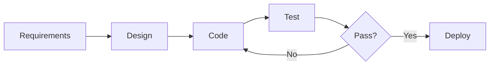
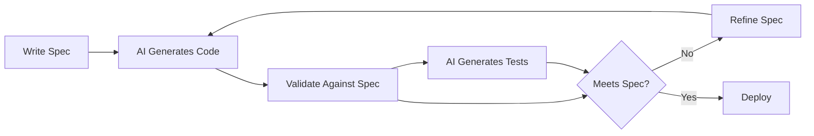
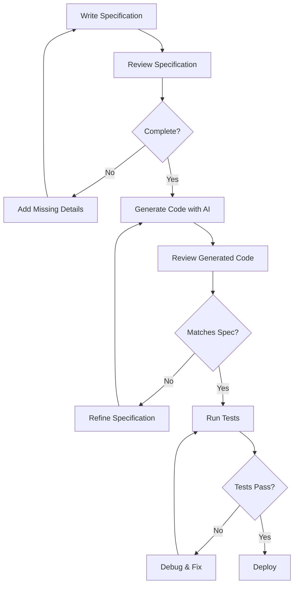

# Chapter 5: Specification-Driven Development (SDD) Fundamentals

import InteractiveDiagram from '@site/src/components/InteractiveDiagram';

<div style={{textAlign: 'center', margin: '3rem 0'}}>
  
</div>

## What is Specification-Driven Development?

**Specification-Driven Development (SDD)** is a methodology where you write detailed, executable specifications **before** any code is implemented. These specifications serve as the contract between your intent and the AI's implementation.

:::info Core Principle
**"Specifications are the new code."**

In traditional development, code was the source of truth.
In AI-native development, specifications are the source of truth—code is a generated artifact.
:::

## The SDD Philosophy

### Traditional Software Development



**Problems:**
- Requirements often vague
- Design disconnected from implementation
- Code as source of truth (hard to change)
- Tests written after (or never)

### Specification-Driven Development



**Advantages:**
- Specifications are clear and complete
- Implementation always matches specification
- Changes happen in specification, regenerate code
- Tests generated from specifications automatically

## The SDD Cycle in Action

<InteractiveDiagram
  title="Specification-Driven Development Lifecycle"
  diagram={`graph TB
    subgraph "📝 Specification Phase"
        Define[Define Requirements] --> Write[Write Specification]
        Write --> Review[Review Completeness]
        Review --> Check{Complete?}
        Check -->|No| Write
        Check -->|Yes| Approve[Approve Spec]
    end

    subgraph "🤖 Implementation Phase"
        Approve --> Generate[AI Generates Code]
        Generate --> GenTests[AI Generates Tests]
    end

    subgraph "✅ Validation Phase"
        GenTests --> RunTests[Run Tests]
        RunTests --> Validate{Meets Spec?}
        Validate -->|No| Analyze[Analyze Gap]
        Analyze --> RefineSpec[Refine Specification]
        RefineSpec --> Generate
        Validate -->|Yes| Deploy[Deploy to Production]
    end

    Deploy --> Monitor[Monitor & Collect Feedback]
    Monitor --> NewReq{New Requirements?}
    NewReq -->|Yes| Define
    NewReq -->|No| Monitor

    style Define fill:#ff4757,stroke:#2f3542,stroke-width:3px
    style Draft fill:#ffa502,stroke:#2f3542,stroke-width:3px
    style Review fill:#ffd700,stroke:#2f3542,stroke-width:3px
    style Approve fill:#00d2d3,stroke:#2f3542,stroke-width:3px
    style Generate fill:#5352ed,stroke:#2f3542,stroke-width:3px
    style GenTests fill:#ff6348,stroke:#2f3542,stroke-width:3px
    style RunTests fill:#a29bfe,stroke:#2f3542,stroke-width:3px
    style Validate fill:#1e90ff,stroke:#2f3542,stroke-width:3px
    style Analyze fill:#fd79a8,stroke:#2f3542,stroke-width:3px
    style RefineSpec fill:#fdcb6e,stroke:#2f3542,stroke-width:3px
    style Deploy fill:#2ed573,stroke:#2f3542,stroke-width:3px
    style Monitor fill:#00b894,stroke:#2f3542,stroke-width:3px
    style NewReq fill:#e17055,stroke:#2f3542,stroke-width:3px`}
  caption="The complete SDD lifecycle showing how specifications drive development from requirements to production."
/>

## The Anatomy of a Good Specification

### The Seven Essential Elements

#### 1. **Context** (The Why)
```markdown
## Context
We're building a task management application for remote teams.
Users need to quickly capture tasks, assign them to teammates,
and track progress across multiple projects.

This feature addresses the most requested user need: recurring tasks.
```

#### 2. **Objectives** (The What)
```markdown
## Objectives
Enable users to create tasks that repeat on a schedule:
- Daily, weekly, monthly, yearly patterns
- Custom intervals (e.g., "every 3 days")
- Ability to pause and resume recurrence
- Automatic creation of next instance when completed
```

#### 3. **Functional Requirements** (The Details)
```markdown
## Functional Requirements

### Task Creation
- **Recurrence Pattern Selection**
  - Radio buttons: None, Daily, Weekly, Monthly, Yearly, Custom
  - If Custom: number input + unit dropdown (days, weeks, months)
  - Preview showing next 5 occurrences

### Task Instance Management
- **Initial Creation:**
  - First instance created immediately
  - Status: Active
  - Due date: Based on pattern start date

- **Completion Behavior:**
  - Mark current instance complete
  - Generate next instance automatically
  - Inherit all properties except:
    - ID (new)
    - Status (reset to active)
    - Due date (calculated from pattern)
    - Created date (new)

### Pausing Recurrence
- "Pause Recurrence" button on task details
- Stops generating new instances
- Existing instances remain
- "Resume Recurrence" button to restart
```

#### 4. **Data Models** (The Structure)
```typescript
## Data Models

interface RecurringTask {
  id: string;
  title: string;
  description?: string;
  assignee_id?: string;
  project_id: string;

  // Recurrence specific
  recurrence_pattern: RecurrencePattern;
  recurrence_start_date: Date;
  recurrence_end_date?: Date; // Optional limit
  is_paused: boolean;

  // Metadata
  created_by: string;
  created_at: Date;
  updated_at: Date;
}

interface RecurrencePattern {
  type: 'daily' | 'weekly' | 'monthly' | 'yearly' | 'custom';
  interval: number; // e.g., 3 for "every 3 days"
  unit?: 'days' | 'weeks' | 'months'; // For custom type

  // Weekly specific
  days_of_week?: number[]; // [1, 3, 5] for Mon, Wed, Fri

  // Monthly specific
  day_of_month?: number; // 1-31
  week_of_month?: number; // 1-4 for "first/second/third/fourth Monday"
  day_of_week?: number; // 0-6 for use with week_of_month
}

interface TaskInstance {
  id: string;
  recurring_task_id: string;
  due_date: Date;
  status: 'active' | 'completed' | 'cancelled';
  completed_at?: Date;
  completed_by?: string;
  created_at: Date;
}
```

#### 5. **Constraints & Edge Cases** (The Gotchas)
```markdown
## Constraints

### Technical Constraints
- Background job must run every 15 minutes to generate instances
- Support timezone-aware recurrence
- Maximum recurrence: 5 years in future
- Limit preview to next 10 instances (performance)

### Business Constraints
- Only Pro plan users can create recurring tasks
- Maximum 100 active recurring tasks per project
- Cannot set recurrence on completed tasks

## Edge Cases

### 1. Invalid Dates (Feb 30th)
**Scenario:** Monthly recurrence on 31st, but month has 30 days
**Handling:** Create instance on last day of month

### 2. Daylight Saving Time
**Scenario:** Recurrence crosses DST boundary
**Handling:** Maintain wall-clock time, not absolute time

### 3. Rapid Completion
**Scenario:** User completes 5 instances in 1 minute
**Handling:** Each completion generates exactly one next instance

### 4. Paused Then Resumed
**Scenario:** Pause for 2 months, resume, pattern was weekly
**Handling:** Resume from current date, don't backfill missed instances

### 5. Recurrence End Date Passed
**Scenario:** End date arrives while background job is down
**Handling:** Don't create new instances, mark recurrence as "completed"
```

#### 6. **Non-Functional Requirements** (The Quality Attributes)
```markdown
## Non-Functional Requirements

### Performance
- Recurrence calculation: < 50ms
- Background job: Process 1000 tasks in < 5 seconds
- UI preview generation: < 100ms

### Reliability
- Background job failure: Retry 3 times with exponential backoff
- Idempotent instance creation: Prevent duplicates
- Database transaction for completion + next instance creation

### Usability
- Pattern selection: No more than 3 clicks
- Preview updates in real-time as user changes pattern
- Clear error messages for invalid patterns

### Accessibility
- Keyboard navigable pattern selection
- Screen reader announces next occurrence dates
- High contrast mode support

### Security
- Validate user owns task before creating recurrence
- Rate limit: 10 recurring task creations per minute per user
- Audit log for pause/resume actions
```

#### 7. **Success Criteria** (The Acceptance Tests)
```markdown
## Success Criteria

### Functional Completeness
- [ ] User can create daily recurrence
- [ ] User can create weekly recurrence (specific days)
- [ ] User can create monthly recurrence (day of month)
- [ ] User can create yearly recurrence
- [ ] User can create custom interval recurrence
- [ ] Preview shows accurate next 5 instances
- [ ] Completing instance creates next instance
- [ ] Pause stops instance creation
- [ ] Resume restarts instance creation

### Quality Standards
- [ ] All edge cases handled gracefully
- [ ] API response times meet targets
- [ ] Background job runs reliably
- [ ] No duplicate instances created
- [ ] Timezone handling correct across DST

### User Experience
- [ ] Feature discoverable in UI
- [ ] Pattern selection intuitive
- [ ] Error messages clear and actionable
- [ ] Works on mobile devices

### Testing
- [ ] Unit tests: 95% coverage
- [ ] Integration tests: All API endpoints
- [ ] E2E tests: Happy path + 3 edge cases
- [ ] Load test: 10K concurrent users
```

## The SpecKit Plus Framework

SpecKit Plus is a structured approach to writing specifications that AI can reliably implement.

### The Four-Layer Specification Model

```markdown
# Layer 1: Vision (Executive Summary)
## One-Paragraph Pitch
What is this feature, who is it for, and why does it matter?

# Layer 2: User Perspective (User Stories)
## As a [user type]
I want to [action]
So that [benefit]

Acceptance Criteria:
- Given [context]
- When [action]
- Then [outcome]

# Layer 3: Technical Specification (Developer View)
## Data Models
## APIs
## Business Logic
## Integration Points

# Layer 4: Implementation Guidance (AI Instructions)
## Code Style
## Libraries to Use
## Patterns to Follow
## Tests to Write
```

### Example: User Authentication Feature

```markdown
# User Authentication System

## Layer 1: Vision
Secure, user-friendly authentication for our SaaS platform that supports email/password and social logins, with session management and security features meeting SOC 2 requirements.

## Layer 2: User Stories

### Story 1: User Registration
**As a** new user
**I want to** create an account with my email and password
**So that** I can access the platform

**Acceptance Criteria:**
- Given I'm on the registration page
- When I enter valid email and strong password
- Then account is created and I'm logged in
- And I receive a verification email

### Story 2: User Login
**As a** registered user
**I want to** log in with my credentials
**So that** I can access my account

**Acceptance Criteria:**
- Given I have an account
- When I enter correct email and password
- Then I'm authenticated and redirected to dashboard
- And my session persists for 7 days

### Story 3: Password Reset
**As a** user who forgot password
**I want to** reset my password via email
**So that** I can regain access to my account

**Acceptance Criteria:**
- Given I click "Forgot Password"
- When I enter my email
- Then I receive a reset link valid for 1 hour
- And I can set a new password

## Layer 3: Technical Specification

### Data Models
```typescript
interface User {
  id: UUID;
  email: string; // Unique, indexed
  password_hash: string; // bcrypt, cost 12
  is_verified: boolean;
  created_at: Date;
  last_login_at?: Date;
}

interface Session {
  id: UUID;
  user_id: UUID; // Foreign key to users
  token: string; // UUID, indexed
  expires_at: Date;
  created_at: Date;
  ip_address: string;
  user_agent: string;
}

interface PasswordResetToken {
  id: UUID;
  user_id: UUID;
  token: string; // Random 32 bytes, hex encoded
  expires_at: Date; // 1 hour from creation
  used_at?: Date;
  created_at: Date;
}
```

### API Endpoints
```yaml
POST /api/auth/register:
  Body: { email: string, password: string }
  Response: { user: User, session_token: string }
  Errors: 400 (validation), 409 (email exists)

POST /api/auth/login:
  Body: { email: string, password: string }
  Response: { user: User, session_token: string }
  Errors: 401 (invalid credentials), 429 (rate limit)

POST /api/auth/logout:
  Headers: { Authorization: "Bearer {session_token}" }
  Response: 204 No Content

POST /api/auth/forgot-password:
  Body: { email: string }
  Response: 204 No Content (always, even if email doesn't exist)

POST /api/auth/reset-password:
  Body: { token: string, new_password: string }
  Response: 200 { message: "Password reset successful" }
  Errors: 400 (token invalid/expired), 422 (weak password)

GET /api/auth/verify-email:
  Query: { token: string }
  Response: 302 Redirect to /login?verified=true
  Errors: 400 (token invalid)
```

### Business Logic Rules
1. **Password Strength:**
   - Minimum 8 characters
   - Must contain: uppercase, lowercase, number, special char
   - Cannot be in common password list (top 10K)
   - Cannot match email local part

2. **Rate Limiting:**
   - Login attempts: 5 per 15 minutes per IP
   - Registration: 3 per hour per IP
   - Password reset: 3 per hour per user

3. **Session Management:**
   - Sessions expire after 7 days
   - Extend expiration on each request
   - Logout invalidates session immediately
   - Limit 5 concurrent sessions per user

4. **Email Verification:**
   - Account created but restricted until verified
   - Verification email sent immediately
   - Resend limit: 3 per hour
   - Token expires after 24 hours

## Layer 4: Implementation Guidance

### Technology Stack
```yaml
Backend:
  - Node.js 18+
  - Express 4.x
  - TypeScript 5.x
  - PostgreSQL 15+
  - Redis 7+ (session storage)

Libraries:
  - bcrypt: Password hashing
  - jsonwebtoken: Token generation
  - zod: Input validation
  - nodemailer: Email sending
  - express-rate-limit: Rate limiting

Testing:
  - Jest: Unit tests
  - Supertest: API tests
  - Faker: Test data generation
```

### Code Organization
```
src/
  modules/
    auth/
      auth.controller.ts
      auth.service.ts
      auth.routes.ts
      auth.middleware.ts
      auth.validation.ts
      __tests__/
        auth.test.ts
        auth.integration.test.ts
  models/
    User.ts
    Session.ts
    PasswordResetToken.ts
  utils/
    password.util.ts
    email.util.ts
    token.util.ts
```

### Security Requirements
- Use HTTPS only (enforce in production)
- Set secure cookie flags: HttpOnly, Secure, SameSite=Strict
- Sanitize all inputs (prevent SQL injection, XSS)
- Hash passwords with bcrypt (never store plaintext)
- Implement CSRF protection
- Add security headers (helmet.js)
- Log failed login attempts
- Implement account lockout after 10 failed attempts

### Testing Requirements
```typescript
// Unit tests
- Password hashing and validation
- Token generation and verification
- Email address validation
- Password strength checking

// Integration tests
- POST /api/auth/register (success, duplicate email, weak password)
- POST /api/auth/login (success, wrong password, nonexistent user)
- POST /api/auth/logout (success, invalid token)
- Password reset flow (end-to-end)
- Email verification flow (end-to-end)

// E2E tests
- User can register, receive email, verify, and login
- User can reset password and login with new password
- Sessions persist across page refreshes
- Rate limiting prevents brute force attacks
```
```

## From Specification to Implementation

### The AI Implementation Loop



### Giving AI the Specification

**Prompt Template:**
```markdown
# Task: Implement [Feature Name]

## Specification
[Paste complete specification]

## Implementation Instructions

### Phase 1: Database Schema
- Create migrations for all models
- Add appropriate indexes
- Include seed data for development

### Phase 2: Core Business Logic
- Implement service layer
- Add validation
- Handle edge cases per specification

### Phase 3: API Endpoints
- Create controllers and routes
- Add middleware (auth, validation, rate limiting)
- Include error handling

### Phase 4: Tests
- Unit tests for business logic
- Integration tests for APIs
- E2E tests for critical flows

### Phase 5: Documentation
- OpenAPI/Swagger documentation
- README for developers
- API usage examples

Please implement Phase 1 first, then I'll review before proceeding.
```

## Common Specification Mistakes

### Mistake 1: Under-Specification

❌ **Too Vague:**
```markdown
# User Authentication
Add login functionality
```

✅ **Properly Specified:**
```markdown
# User Authentication

## Functional Requirements
- Email/password authentication
- Session-based (JWT tokens)
- Password reset via email
- Email verification
- Rate limiting on login attempts

## Security Requirements
- bcrypt password hashing (cost: 12)
- HTTPS only
- CSRF protection
- Secure cookie settings

## Success Criteria
- Users can register, login, logout
- Passwords cannot be weak
- Failed login attempts are rate-limited
- Sessions expire after 7 days
```

### Mistake 2: Over-Specification (Implementation Details)

❌ **Too Prescriptive:**
```markdown
Use exactly this SQL query:
SELECT * FROM users WHERE email = $1
Then use bcrypt.compare() with exactly these options:
{
  cost: 12,
  salt: bcrypt.genSaltSync(12)
}
Store the result in a variable called hashedPassword
Then compare using ===
```

✅ **Appropriately Specified:**
```markdown
## Password Verification
- Use bcrypt for comparison
- Cost factor: 12
- Constant-time comparison
- Return boolean (match/no match)
- Log failed attempts
```

### Mistake 3: Missing Edge Cases

❌ **Happy Path Only:**
```markdown
## User Registration
1. User enters email and password
2. System creates account
3. User is logged in
```

✅ **Including Edge Cases:**
```markdown
## User Registration

### Happy Path
1. User enters email and password
2. System validates input
3. System creates account
4. System sends verification email
5. User is logged in (but restricted until verified)

### Edge Cases
1. **Email already exists**
   - Show: "An account with this email already exists"
   - Offer: "Login" or "Reset password"

2. **Invalid email format**
   - Show: "Please enter a valid email address"
   - Example: user@example.com

3. **Weak password**
   - Show: "Password must be at least 8 characters and include uppercase, lowercase, number, and special character"
   - Display: Password strength meter

4. **Email service down**
   - Create account anyway
   - Queue verification email for retry
   - Show: "Account created. Verification email will arrive shortly."

5. **Database connection lost**
   - Don't create partial account
   - Show: "Something went wrong. Please try again."
   - Log error for investigation
```

## The Specification Review Checklist

Before handing your specification to AI:

### Completeness
- [ ] Context explains the "why"
- [ ] Objectives are clear and measurable
- [ ] All functional requirements listed
- [ ] Data models fully defined (types, constraints)
- [ ] API endpoints specified (method, path, body, responses)
- [ ] Non-functional requirements included (performance, security)
- [ ] Edge cases identified and handled
- [ ] Success criteria defined

### Clarity
- [ ] No ambiguous terms (define all domain-specific words)
- [ ] Examples provided for complex concepts
- [ ] Diagrams included where helpful
- [ ] Consistent terminology throughout

### Feasibility
- [ ] Requirements are technically achievable
- [ ] No contradictory requirements
- [ ] Realistic performance targets
- [ ] Appropriate scope (not too large for one implementation)

### Testability
- [ ] Acceptance criteria are verifiable
- [ ] Success metrics are measurable
- [ ] Test scenarios included
- [ ] Expected outcomes defined

## Key Takeaways

1. **Specifications are your most valuable asset** in AI-native development
2. **Invest time in specifications**, save time in implementation
3. **Clarity beats brevity**—be thorough, not terse
4. **Edge cases are not edge cases** to AI—handle them explicitly
5. **Iterate on specs**, not code—changing specs regenerates code easily

:::tip Next Step
You now understand the theory of Specification-Driven Development. Next, let's dive into the practical implementation language of AI: **Part 5: Python Fundamentals - The Language of AI Agents**.
:::


---

## 🎴 Test Your Knowledge

import Flashcards, { ChapterFlashcards } from '@site/src/components/Flashcards';

<Flashcards cards={ChapterFlashcards.ch8} title="Chapter Flashcards" />

---

## 📝 Chapter Quiz

import MCQ, { ChapterMCQ } from '@site/src/components/MCQ';

<MCQ questions={ChapterMCQ.ch5} title="Chapter 5 Quiz" />

---
